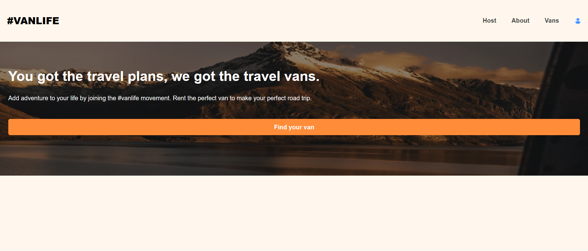
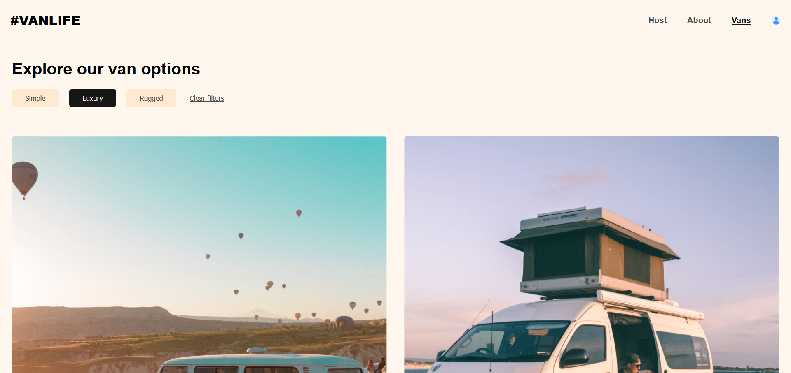
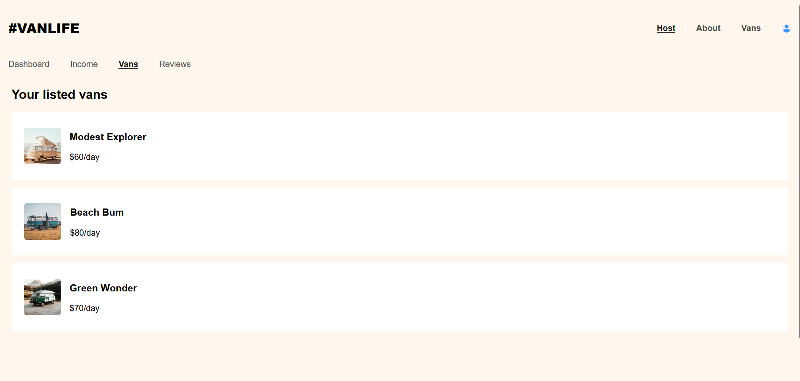

# Vans Project

This project was created as part of a learning journey. I followed a tutorial on YouTube to develop this project. You can find the tutorial [here](https://youtu.be/nDGA3km5He4?si=4gVx8UJWtBDmHWoL).

## Introduction

The "Vans" project is a React application aimed at learning React Router. It includes deep nested routes, protected routes, loaders, etc..

## Features

- Implementation of React Router for navigation.
- Pages: Home, About, and a protected page called Host.
- Integration with Python and Flask for the backend.

**Screenshots**

## Installation

### Prerequisites

Before you can run Rental, ensure you have the following software and tools installed:

- [Node.js](https://nodejs.org/) (for the frontend)
- [Python](https://www.python.org/) (for the backend)
- [Flask](https://flask.palletsprojects.com/en/2.0.x/) (Python web framework)
- Git (optional, for version control and collaboration)

### Setup

1.  **Clone the repository.**

    git clone https://github.com/illaan/playground-vans

2.  **Navigate to the Projcet Directories**

After cloning the repository, you'll need to navigate to the frontend and backend directories to install their respective dependencies and run the servers. Here's how to do it:

_Frontend Directory_:

Open your terminal or command prompt and execute the following commands to navigate to the frontend directory:
`cd rental`

_Backend Directory_:

Navigate to the backend directory using the following commands:

`cd rental`
`cd api`

3. **Install dependencies**

In the rental directory:
`npm install`

4. **Start the Servers**

In the vans-backend directory, start the backend server with the following command:
`python app.py`

In the vans-frontend directory, start the frontend server with the following command:
`npm run dev`
